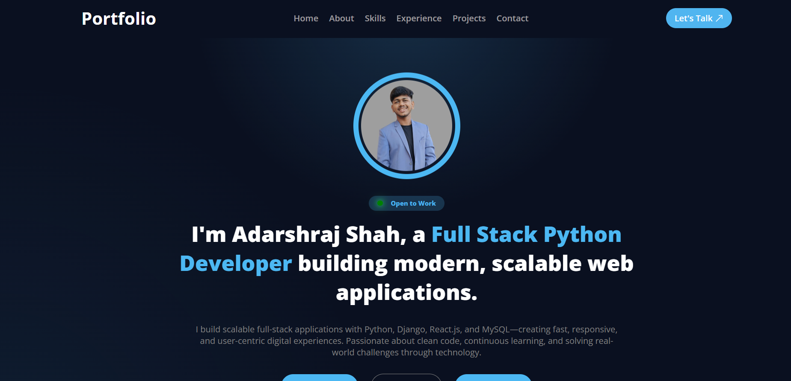

# 👋 Hi, I'm Adarsh Raj Shah

## 🚀 Software Developer

Welcome to my personal portfolio repository! This portfolio showcases my skills, projects, experience, and contact information. It is built with React.js and designed with a modern, responsive, and user-friendly interface.

## 🌐 Live Demo

🔗 https://adarshshah.netlify.app/

---

## 📸 Portfolio Preview

> Add a screenshot of your portfolio inside the `public` folder and update the path below.

![Portfolio Preview]


---

## ✨ Features

- 🎨 Modern & Clean UI
- 📱 Fully Responsive Design
- ⚡ Smooth Scrolling Navigation
- 🎯 Active Navigation Highlight
- 💼 About Me Section
- 🛠 Skills Showcase
- 📂 Project Gallery
- 💻 Experience Section
- 📧 Functional Contact Form (Web3Forms)
- 🔍 SEO Optimized
- 🌐 Google Search Console Verified
- 🚀 Deployed on Netlify

---

## 🛠 Tech Stack

### Frontend

- React.js
- JavaScript (ES6+)
- HTML5
- CSS3
- Bootstrap
- CSS Modules

### Tools

- Git
- GitHub
- VS Code
- Netlify
- Postman

### APIs & Services

- Web3Forms API

---

## 📁 Project Structure

```
Portfolio
│
├── public/
│   ├── logo.png
│   ├── robots.txt
│   ├── sitemap.xml
│
├── src/
│   ├── assets/
│   ├── components/
│   ├── App.jsx
│   ├── main.jsx
│
├── index.html
├── package.json
└── README.md
```

---

## 🚀 Getting Started

Clone the repository

```bash
git clone https://github.com/adarshrajshah04/your-repository-name.git
```

Go to the project folder

```bash
cd your-repository-name
```

Install dependencies

```bash
npm install
```

Start development server

```bash
npm run dev
```

Create production build

```bash
npm run build
```


## 📬 Contact

**Email**

📧 adarshrajshah04@gmail.com

**LinkedIn**

🔗 https://www.linkedin.com/in/adarshraj-shah-a38518378

**GitHub**

🔗 https://github.com/adarshrajshah04

---

## 🤝 Contributing

Contributions, issues, and feature requests are welcome.

If you like this project, feel free to fork the repository and submit a pull request.

---

## ⭐ Show Your Support

If you found this project helpful, please consider giving it a ⭐ on GitHub.

---

## 📄 License

This project is licensed under the MIT License.

---

## 👨‍💻 Developed By

**Adarsh Raj Shah**

Software Developer

⭐ Thank you for visiting my portfolio!